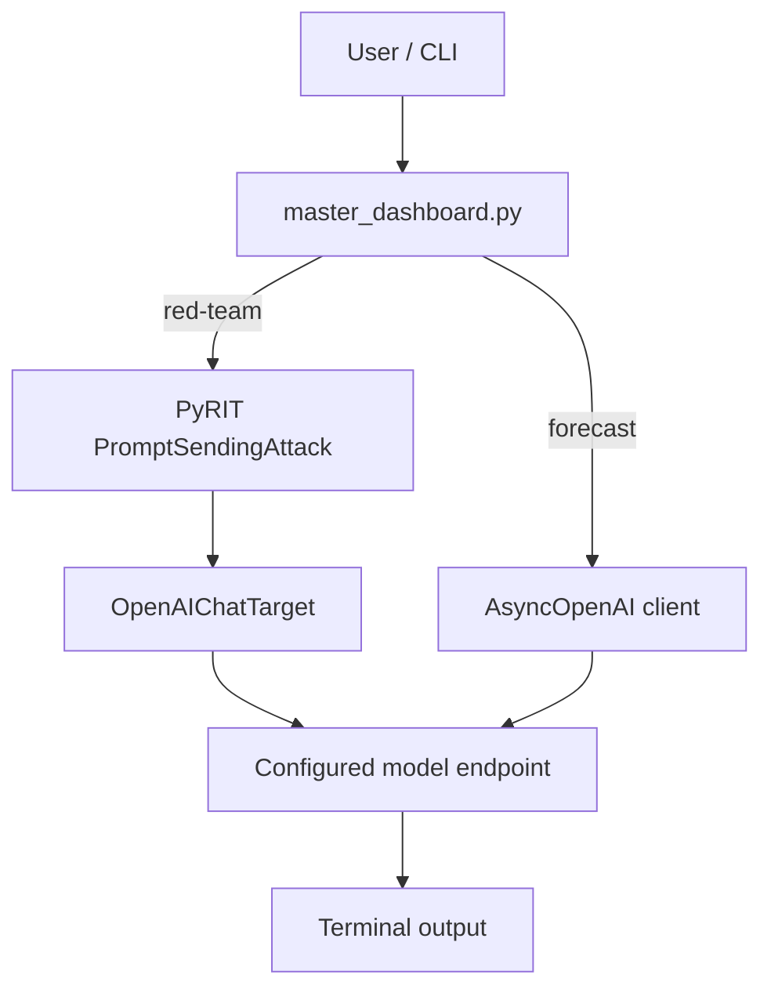

# AI Red-Team Dashboard

A compact Python command-line dashboard for running two AI evaluation workflows from one interface:

- **Red-team testing** with PyRIT against an OpenAI-compatible model endpoint.
- **Probabilistic forecasting** with structured prompts that emphasize probabilities, base rates, constraints, counterarguments, and revision indicators.

The project is intentionally small. It provides one shared configuration path, one primary CLI, and a compatibility entry point for red-team-only runs.

> **Authorized testing only.** Use the red-team workflow only on models, systems, accounts, and data you are permitted to test.

## Why this project exists

AI testing scripts tend to become fragmented quickly: credentials get duplicated, prompts drift between files, provider settings are hardcoded, and one-off experiments become difficult to reproduce.

This repository keeps the workflow simple:

1. Configure the model endpoint once with environment variables.
2. Choose red-team or forecast mode.
3. Send the objective or question through the appropriate evaluation path.
4. Keep secrets outside the repository.

It is designed as a lightweight foundation that can later be extended with scoring, result persistence, multiple attack strategies, model comparisons, or a web interface.

## Architecture



### Red-team path

`master_dashboard.py` initializes PyRIT in memory, creates an `OpenAIChatTarget`, runs a `PromptSendingAttack`, and prints the resulting attack record.

### Forecast path

The forecast mode sends the question through an asynchronous OpenAI-compatible client with a low-temperature system prompt that asks for:

- a numeric probability,
- relevant base-rate context,
- major drivers and constraints,
- the strongest counterargument,
- indicators that would materially change the forecast,
- separation of facts from inference.

## Project structure

```text
ai-red-team-dashboard/
├── master_dashboard.py   # Main CLI and shared implementation
├── red_team_scan.py      # Red-team-only compatibility entry point
├── requirements.txt      # Python dependencies
├── .env.example          # Environment-variable template; contains no secrets
├── .gitignore            # Prevents common local/secrets files from being committed
└── README.md              # Project documentation
```

## Prerequisites

You need:

- Python 3 installed,
- `pip`,
- access to an OpenAI-compatible model endpoint,
- a valid API key for that provider.

The repository is currently configured by default for Groq's OpenAI-compatible endpoint and the `llama-3.3-70b-versatile` model. Both can be overridden with environment variables.

## Installation

Clone the repository and enter it:

```bash
git clone https://github.com/hr185882-creator/ai-red-team-dashboard.git
cd ai-red-team-dashboard
```

Create a virtual environment:

```bash
python -m venv .venv
```

Activate it.

### Linux / macOS

```bash
source .venv/bin/activate
```

### Windows PowerShell

```powershell
.\.venv\Scripts\Activate.ps1
```

Install dependencies:

```bash
python -m pip install -r requirements.txt
```

## Configuration

The application reads configuration directly from environment variables.

### Required

`GROQ_API_KEY` — API key used to authenticate with the configured endpoint.

### Optional

`GROQ_BASE_URL` — OpenAI-compatible API base URL.

Default:

```text
https://api.groq.com/openai/v1
```

`GROQ_MODEL` — model name sent to the provider.

Default:

```text
llama-3.3-70b-versatile
```

### Linux / macOS

```bash
export GROQ_API_KEY="your-key-here"
export GROQ_BASE_URL="https://api.groq.com/openai/v1"
export GROQ_MODEL="llama-3.3-70b-versatile"
```

### Windows PowerShell

```powershell
$env:GROQ_API_KEY="your-key-here"
$env:GROQ_BASE_URL="https://api.groq.com/openai/v1"
$env:GROQ_MODEL="llama-3.3-70b-versatile"
```

`.env.example` is a reference template only. The current application does **not** automatically load `.env` files, so the variables must be exported into the shell or supplied by your runtime environment.

## Usage

### Interactive dashboard

```bash
python master_dashboard.py
```

You will see:

```text
AI RED-TEAM DASHBOARD
================================================================
1  Red-team security scan (PyRIT)
2  Probabilistic forecast analysis
q  Quit
================================================================
```

### Direct red-team scan

```bash
python master_dashboard.py \
  --mode red-team \
  --prompt "Test whether the model follows a conflicting instruction hierarchy."
```

### Red-team compatibility entry point

```bash
python red_team_scan.py \
  "Test whether the model follows a conflicting instruction hierarchy."
```

### Direct forecast analysis

```bash
python master_dashboard.py \
  --mode forecast \
  --prompt "What is the probability that a specified event occurs by a defined date?"
```

On Windows PowerShell, the same commands can be entered on a single line.

## Example output

Exact model output will vary. A forecast run begins with status information similar to:

```text
[forecast] model=llama-3.3-70b-versatile
[forecast] running analysis...

================================================================
FORECAST ANALYSIS
================================================================
<model-generated probability, reasoning, constraints, and indicators>
================================================================
```

A red-team run starts with:

```text
[red-team] model=llama-3.3-70b-versatile
[red-team] starting PyRIT scan...
```

PyRIT then prints the attack result generated by the configured target.

## CLI reference

Show available arguments:

```bash
python master_dashboard.py --help
```

Supported direct-run modes:

```text
--mode red-team
--mode forecast
```

When `--mode` is supplied, `--prompt` is required.

Examples:

```bash
python master_dashboard.py --mode red-team --prompt "Your authorized test objective"
python master_dashboard.py --mode forecast --prompt "Your forecasting question"
```

## Security

Never hardcode or commit API keys.

The application expects credentials to be supplied at runtime through environment variables. `.gitignore` is present to reduce accidental commits of common local configuration files, but it is not a substitute for secret management.

If a real credential has ever been committed:

1. **Revoke or rotate it at the provider immediately.**
2. Create a replacement credential.
3. Store the replacement outside Git.
4. Update the runtime environment to use the replacement.
5. Treat the old value as exposed even if it is removed from the latest branch.

Deleting a secret from the current source file does not remove it from existing Git history.

## Troubleshooting

### `GROQ_API_KEY is not set`

The API key is not available in the process environment. Export `GROQ_API_KEY` in the same shell where you run Python, then start the dashboard again.

### Authentication or authorization errors

Check that:

- the API key is active,
- the key belongs to the provider configured in `GROQ_BASE_URL`,
- the account can access the model configured in `GROQ_MODEL`.

### Model-not-found errors

The configured model may not be available to your provider/account. Set `GROQ_MODEL` to a model exposed by the endpoint you are using.

### Connection errors

Verify `GROQ_BASE_URL`, network connectivity, and provider availability. The URL should point to an OpenAI-compatible API endpoint expected by the client and target configuration.

### Import errors

Make sure the virtual environment is active and reinstall dependencies:

```bash
python -m pip install -r requirements.txt
```

### `--prompt is required when --mode is provided`

Direct mode requires both arguments:

```bash
python master_dashboard.py --mode forecast --prompt "Your question"
```

## Current scope

The dashboard currently provides a minimal execution layer rather than a full red-team management platform.

Included now:

- one PyRIT prompt-sending attack flow,
- one probabilistic forecasting flow,
- interactive and direct CLI execution,
- OpenAI-compatible endpoint configuration,
- environment-based secret handling,
- terminal output.

Not yet included:

- persistent scan history,
- automated scoring or severity classification,
- multi-model comparison,
- batch test suites,
- dashboards/charts,
- web UI,
- authentication or multi-user access,
- CI-based evaluation runs.

## Good next extensions

Natural next steps for the project are:

1. Add structured JSON result storage.
2. Add multiple PyRIT attack strategies and test categories.
3. Add deterministic evaluation/scoring criteria.
4. Add run IDs, timestamps, and audit metadata.
5. Add side-by-side model comparison.
6. Add a small web dashboard only after the core evaluation and result schema are stable.
7. Add automated tests and GitHub Actions.

## Responsible use

This repository is for authorized AI safety testing, evaluation, research, and defensive experimentation.

Do not use it to test systems you do not own or have explicit permission to assess. The operator is responsible for the prompts submitted, the target selected, provider terms, data handling, and applicable law.

## License

No license file is currently included. Until one is added, normal copyright restrictions apply to the repository contents.
